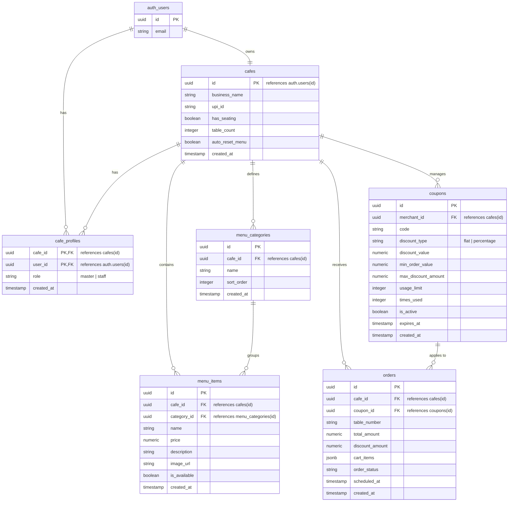

# QuickOrder

A digital QR-menu and ordering system for cafes and small restaurants. Built with Next.js and Supabase, it allows customers to scan a table-specific QR code, browse the menu, apply coupons, and place orders.

To avoid middleman transaction fees, the app uses direct UPI deep links (`upi://pay`) so customers pay the merchant directly. This eliminates payment gateway commissions and payout delays.

---

## Features

### For Merchants
* **Live Dashboard:** Real-time incoming, preparing, and completed order tracking using Supabase Realtime.
* **Order Scheduling:** Active tracking for scheduled orders (`scheduled_at`). The dashboard features automated status timers showing exact countdowns (e.g., "Scheduled in 45m") and overdue warnings (e.g., "Due 10m ago" highlighted in red).
* **Promo & Coupon Manager:** Create and toggle discount coupons (flat or percentage-based) with validation rules like minimum order value, maximum discount caps, usage limits, and expiration dates.
* **Role-Based Access Control (RBAC):** Multi-tenant staff management supporting `master` (owner) and `staff` roles. Masters have full management rights, while staff handle day-to-day order workflows.
* **Audio Alerts:** Sound notifications when new orders arrive (designed to bypass browser autoplay restrictions via a user-gesture opt-in banner).
* **QR Code Generator:** Generate table-specific QR codes with options to print single/batch or download as SVGs.
* **Daily Menu Reset Configuration:** Configure whether out-of-stock menu items should automatically reset to "available" daily at midnight.
* **Menu & Category Controls:** Group menu items into custom categories with custom sorting orders, add description text and image URLs, and toggle availability instantly.

### For Customers
* **Storefront:** A fast, mobile-first menu showing category-wise available items with rich description text and image previews.
* **Persistent Cart:** A client-side cart that saves state in local storage so items aren't lost on page reload.
* **Discount Code Checkout:** Apply active promo codes directly in the cart before placing orders.
* **Direct UPI Payments:** Opens UPI apps (GPay, PhonePe, Paytm, BHIM) on mobile with the amount, business name, and transaction ID pre-filled.
* **Real-time Order Status:** Active orders can be tracked (`pending` -> `preparing` -> `done`) directly from the browser receipt.

---

## Tech Stack

* **Frontend:** Next.js (App Router), React, Tailwind CSS (Vanilla CSS variables configuration)
* **Database & Auth:** Supabase (PostgreSQL, GoTrue Auth, Realtime, pg_cron for scheduled resets)
* **Hosting:** Cloudflare Pages (using `@cloudflare/next-on-pages` for edge rendering)
* **Libraries:** `react-qr-code` for SVG generation

---

## Database Schema

The database consists of tables managing cafes, roles, categories, menu items, coupons, and orders:



---

## UPI Deep Linking & Payment Verification

Direct UPI checkouts are initiated by redirecting the customer's mobile browser to a deep link:

```
upi://pay?pa=[UPI_ID]&pn=[BusinessName]&tr=[OrderID]&mc=5812&am=[TotalAmount]&cu=INR&tn=[Metadata]
```

### Important Parameters:
* **`tr` (Transaction Reference):** Stored as the Supabase Order ID. This helps the merchant match bank credit notifications back to specific orders.
* **`mc` (Merchant Category Code):** Set to `5812` (Restaurants/Dining). Specifying this category code forces consumer UPI apps (like GPay and PhonePe) to prefill the transaction amount `am` even if the recipient is a personal UPI ID, which prevents checkout issues caused by strict P2P transfer limits.

---

## Local Setup

### 1. Install dependencies
```bash
git clone https://github.com/Spido7/quickorder.git
cd quickorder
npm install
```

### 2. Configure environment variables
Create a `.env.local` file in the root:
```env
NEXT_PUBLIC_SUPABASE_URL=your_supabase_project_url
NEXT_PUBLIC_SUPABASE_ANON_KEY=your_supabase_anon_key
```

### 3. Database migrations
All database migrations are located in `/supabase/migrations`. Apply them in order to configure your database schema, relations, triggers, and Row-Level Security policies:
1. `001_initial_schema.sql` (Creates core `cafes`, `menu_items`, and `orders` tables).
2. `002_coupons_and_discounts.sql` (Initializes coupons and coupon usage triggers).
3. `003_auto_reset_menu_items.sql` (Enables pg_cron and configures midnight reset).
4. `004_add_auto_reset_preference.sql` (Adds `auto_reset_menu` toggle and `cafe_profiles` RBAC).
5. `005_add_menu_categories.sql` (Sets up category grouping schema).
6. `006_fix_cafe_profiles_rls_recursion.sql` (Resolves profile check loops with a security definer).
7. `007_verify_menu_relations.sql` (Validates item constraints and applies multi-tenant policies).
8. `008_add_order_scheduling.sql` (Adds scheduling Support).
9. `009_fix_cafe_profiles_insert_rls.sql` (Allows new registration insert policies).

### 4. Enable Row Level Security (RLS)
Ensure RLS is active on all tables in your Supabase schema:
```sql
alter table public.cafes enable row level security;
alter table public.cafe_profiles enable row level security;
alter table public.menu_categories enable row level security;
alter table public.menu_items enable row level security;
alter table public.coupons enable row level security;
alter table public.orders enable row level security;
```

### 5. Daily Reset pg_cron Configuration
If your database is hosted on Supabase, the daily reset cron job is scheduled automatically using the `pg_cron` extension. It updates all out-of-stock items back to available at midnight IST (`30 18 * * *` UTC) only for cafes that have enabled `auto_reset_menu = true`.

### 6. Run the dev server
```bash
npm run dev
```
Open `http://localhost:3000` to view the app locally.

---

## Troubleshooting & Local QR Scanning

### 1. QR Code Scans Not Opening the Menu
If you scan a generated QR code from your mobile device during local development and the page fails to load (e.g., connection timed out or `localhost` refused to connect):
* **Cause:** The generator previously encoded `window.location.origin` (`http://localhost:3000` locally). Mobile devices scanning this cannot resolve `localhost` since it points back to the mobile device itself.
* **Solution:** Configure your local network IP or public tunnel (like Ngrok) in your `.env.local` file:
  ```env
  NEXT_PUBLIC_APP_URL=http://192.168.1.15:3000
  ```
  The dashboard reads this variable, strips trailing slashes, and encodes the correct network address into the generated QR codes.

### 2. "Menu not found" Error after Scanning
If the scanned URL successfully opens but shows a **"Menu not found"** error screen:
* **Cause:** Row Level Security (RLS) is enabled on the `cafes` table, but there was no public SELECT policy. Since customers view the storefront anonymously, the database returned 0 rows for the cafe lookup query.
* **Solution:** Ensure the following SELECT policy is active in your Supabase database (this is included in `/supabase/migrations/001_initial_schema.sql`):
  ```sql
  create policy "Public cafe read"
    on public.cafes for select
    using (true);
  ```

### 3. Promo Codes Validation Issues
If promo codes are not showing or validation fails on checkout:
* Verify that the coupon is active (`is_active = true`), has not expired (`expires_at`), and the order amount meets the minimum order limit (`min_order_value`).
* Inspect the browser logs for `/api/validate-coupon` response payloads to confirm the specific validation rule failure.
