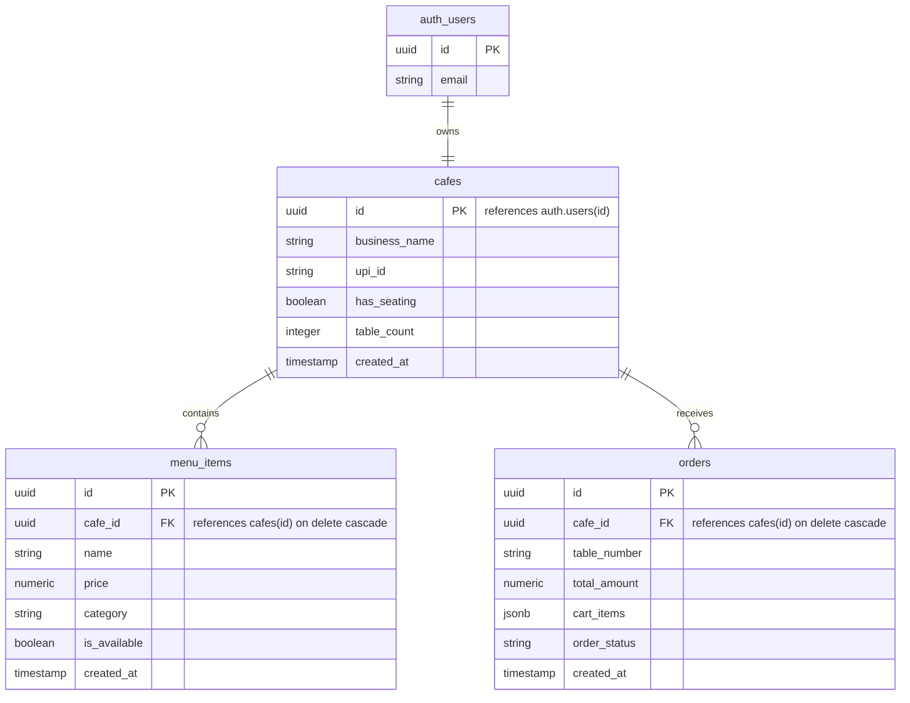

# QuickOrder

A digital QR-menu and ordering system for cafes and small restaurants. Built with Next.js and Supabase, it allows customers to scan a table-specific QR code, browse the menu, and order.

To avoid middleman transaction fees, the app uses direct UPI deep links (`upi://pay`) so customers pay the merchant directly. This eliminates payment gateway commissions and payout delays.

## Features

### For Merchants
* **Live Dashboard:** Real-time incoming, preparing, and completed order tracking using Supabase Realtime.
* **Audio Alerts:** Chime notifications when new orders arrive (designed to bypass browser autoplay restrictions).
* **QR Code Generator:** Generate table-specific QR codes with options to print single/batch or download as SVGs.
* **Menu Controls:** Toggle item availability instantly from the dashboard.
* **Onboarding Setup:** A simple multi-step wizard for new cafes to configure their seating structure, business details, UPI ID, and initial menu.

### For Customers
* **Storefront:** A fast, mobile-first menu showing category-wise available items.
* **Persistent Cart:** A client-side cart that saves state in local storage so items aren't lost on refresh.
* **Direct UPI Payments:** Opens GPay, PhonePe, Paytm, or BHIM with the amount and transaction ID pre-filled.
* **Real-time Order Status:** Active orders can be tracked (`pending` -> `preparing` -> `done`) directly from the browser receipt.

---

## Tech Stack

* **Frontend:** Next.js (App Router), React, Tailwind CSS
* **Database & Auth:** Supabase (PostgreSQL, GoTrue Auth, Realtime)
* **Hosting:** Cloudflare Pages (using `@cloudflare/next-on-pages` for edge rendering)
* **Libraries:** `react-qr-code` for SVG generation

---

## Database Schema

The database consists of three main tables:



---

## The Neo-Brutalist Theme

The application uses a high-contrast Neo-Brutalist aesthetic rather than standard rounded SaaS layouts:
* Thick black borders on cards, buttons, and inputs (`border-2 border-black` or `border-3`).
* Hard, flat offset drop shadows with no blur (`shadow-[4px_4px_0px_0px_#000]`).
* Click translations that push active buttons down/right while hiding the shadow to simulate a physical press.
* Cream and off-white base colors (`bg-[#f5f2eb]`) accented with warning yellow and success green.

---

## UPI Deep Linking & Payment Verification

Direct UPI checkouts are initiated by redirecting the customer's mobile browser to a deep link:

```
upi://pay?pa=[UPI_ID]&pn=[BusinessName]&tr=[OrderID]&mc=5812&am=[TotalAmount]&cu=INR&tn=[Metadata]
```

### Important Parameters:
* `tr` (Transaction Reference): Stored as the Supabase Order ID. This helps the merchant match bank credit notifications back to specific orders.
* `mc` (Merchant Category Code): Set to `5812` (Restaurants/Dining). Specifying this category code forces consumer UPI apps (like GPay and PhonePe) to prefill the transaction amount `am` even if the recipient is a personal UPI ID, which prevents checkout issues caused by strict P2P transfer limits.

---

## Local Setup

### 1. Install dependencies
```bash
git clone https://github.com/your-username/quickorder.git
cd quickorder
npm install
```

### 2. Configure environment variables
Create a `.env.local` file in the root:
```env
NEXT_PUBLIC_SUPABASE_URL=your_supabase_project_url
NEXT_PUBLIC_SUPABASE_ANON_KEY=your_supabase_anon_key
```

### 3. Database migrations
Run the SQL migration located in `/supabase/migrations/001_initial_schema.sql` in your Supabase SQL Editor.

To ensure merchant profiles are deleted when testing or deleting users, configure the foreign key with `ON DELETE CASCADE`:
```sql
alter table public.cafes
drop constraint if exists cafes_id_fkey,
add constraint cafes_id_fkey
foreign key (id) references auth.users(id)
on delete cascade;
```

### 4. Enable Row Level Security (RLS)
Enable RLS on your public tables to prevent unauthorized access via client-side keys:
```sql
alter table public.cafes enable row level security;
alter table public.menu_items enable row level security;
alter table public.orders enable row level security;
```

### 5. Run the dev server
```bash
npm run dev
```
Open `http://localhost:3000` to view the app locally.
